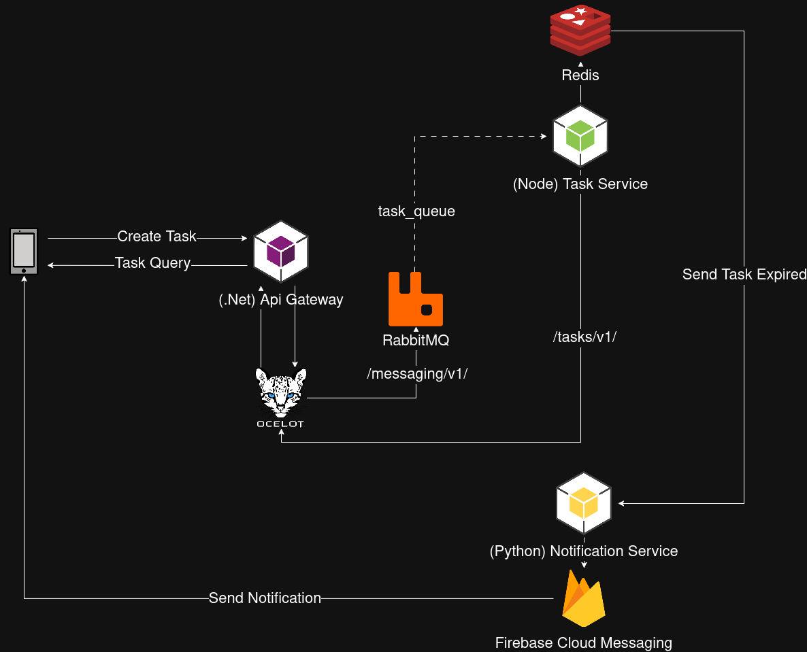

# DontForgetGateway

O **DontForgetGateway** é o ponto único de entrada da aplicação *Dont Forget App*. Ele é responsável por autenticação, exposição das APIs públicas e orquestração da comunicação entre o cliente e os serviços de backend. Se tratando de uma Prova de Conceito (PoC) voltada ao estudo de **CQRS** e arquitetura orientada a eventos.

## Arquitetura



## Pré-requisitos

-   Docker
-   Docker Compose

## Configuração de Ambiente

O Gateway depende de um arquivo `.env` para funcionar corretamente.

Crie o arquivo `.env` com base no exemplo:

``` bash
cp .env.example .env
```

## Executando Aplicação

Para subir o Gateway juntamente com suas dependências:

``` bash
docker compose up
```

O serviço ficará disponível conforme a porta configurada no
`docker-compose.yml`.
